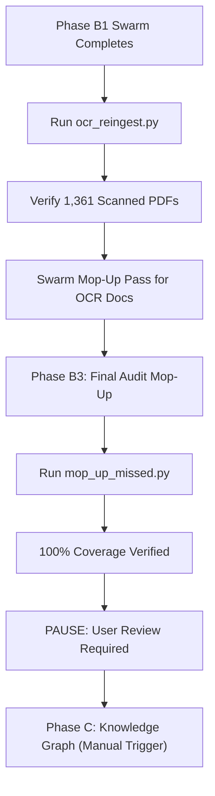

# Phase C: Agentic GraphRAG — Implementation Plan

## Pre-flight Audit Results

| Metric | Value |
|---|---|
| Total documents in DB | 71,232 |
| Still at 15k truncation limit | 17,511 (being fixed by `reingest_truncated.py`) |
| Largest document | 2.39M chars (a full raadsvergadering notulen) |
| Docs > 100k chars | 2,860 |
| Docs > 50k chars | 4,749 |

**Document types already in the database:**
| Type | Count |
|---|---|
| Overig (incl. bijlagen, maps, etc.) | 35,370 |
| Brief | 11,830 |
| **Motie** | **9,072** |
| Besluitenlijst | 4,222 |
| Verslag | 2,967 |
| **Raadsvoorstel** | **2,428** |
| Annotatie | 2,073 |
| **Financieel** | **1,761** |
| **Notulen** | **979** |
| **Amendement** | **530** |

**→ Answer to question (i): YES.** All document types are already being ingested indiscriminately — every document attached to every agenda item is downloaded.

---

## i. Zero-Truncation Strategy

### The Problem
`preserve_notulen_text()` removes the 15k limit, but the result is stored as a single Postgres TEXT blob. For a 2.39M char document, this is fine for storage but not for indexing — Gemini's context window (~1M tokens) can handle it for chunking in one pass.

### The Guarantee
1. **No hard character limit anywhere.** The `preserve_notulen_text()` method has `max_length=None`. Postgres TEXT columns support up to 1GB. No truncation will happen.
2. **`reingest_truncated.py`** (already running) will re-fetch the full content for all 17,511 documents that were previously capped at 15k.
3. For **genuinely unextractable content** (e.g., scanned images before OCR era): content will be empty — this is honest, not truncation. The native macOS OCR falls back for these.

---

## ii. Zero-Loss Chunking Architecture

### Core Principle
**Full text is stored in Postgres. Chunks are derived from it. No chunk process deletes source data.**

### For standard documents (< 800k chars)
Gemini receives the full text in one API call and returns semantic chunks:
- Each chunk includes: `title`, `exact text`, `3–5 hypothetical questions`
- Chunks are stored in Postgres `document_chunks` table + Qdrant (with embeddings)
- **Chunk overlap:** 10% overlap between adjacent chunks to preserve context at boundaries

### Large Document Resilience
- **Windowing**: 50k char windows with 20k char overlap.
- **Deduplication**: Implement per-document chunk de-duplication based on text hash.
- **Scaling**: Launch **Worker 1 and Worker 2 immediately**. Increase `MAX_WORKERS` to **5**. 
- **Small-Doc Targeting**: Workers **4 and 5** will prioritize smaller documents (`ORDER BY length ASC`) to increase variety and ensure the swarm handles both massive and minor documents effectively within the TPM budget.
- **Batching**: Fixed 100-chunk batching to avoid Qdrant payload limits. Overhead is negligible (~1% latency increase) while preventing fatal 400 errors on large documents.
- All chunks are stored; nothing from any section is dropped
- A `parent_document_id` links chunks back to original document

### Chunking coverage targets
- **All 71k+ documents** — not just notulen (current scope is too narrow)
- Type-aware chunking strategies per document type (see §iii)

---

## iii. Structure-Aware Chunking for Financial Documents

### Problem
Financial documents contain tables with row/column relationships that break when chunked naively. A budget row like `"Onderwijs | 2024: €12.5M | 2025: €13.1M | Δ: +4.8%"` loses all meaning if split.

### Approach: Document Type Detection + Specialized Chunking

**Step 1 — Classification:** When a document is ingested, classify it:
```
Doc types: motie, amendement, raadsvoorstel, notulen, financieel, brief, overig
```

**Step 2 — Type-specific Gemini chunking prompt:**

- **`financieel`:** Instruct Gemini to treat every table as an atomic unit. Extract tables as structured JSON (`{type: "table", headers: [...], rows: [[...]]}`). This preserves relationships between line items.
- **`motie/amendement`:** Chunk by clause (overwegende dat, verzoekt het college, etc.)
- **`raadsvoorstel`:** Chunk by section (aanleiding, financiën, besluit)
- **`notulen`:** Chunk by speaker turn + topic

**Step 3 — Structured chunk storage:**
The `document_chunks` table gains a `chunk_type` field: `text | table | list | header`.
Tables are stored as both raw text AND structured JSON for future financial queries.

---

## iv. Knowledge Graph Architecture

### Goal
Explicitly map relationships between: documents, people (raadsleden), organizations (fracties), decisions (moties, amendementen), budget lines, policy proposals.

### Technology
**Postgres graph tables** (no extra DB needed) using recursive CTEs for traversal.

### Schema

```sql
-- Entities (nodes)
CREATE TABLE entities (
    id SERIAL PRIMARY KEY,
    type TEXT NOT NULL,      -- 'person', 'fractie', 'topic', 'budget_line', 'document'
    name TEXT NOT NULL,
    metadata JSONB
);

-- Relationships (edges)
CREATE TABLE relationships (
    id SERIAL PRIMARY KEY,
    source_entity_id INTEGER REFERENCES entities(id),
    target_entity_id INTEGER REFERENCES entities(id),
    relation_type TEXT NOT NULL,  -- 'authored', 'voted_for', 'amends', 'references_budget', ...
    document_id TEXT REFERENCES documents(id),
    chunk_id INTEGER REFERENCES document_chunks(id),
    confidence FLOAT DEFAULT 1.0,
    metadata JSONB
);
```

### Relationship types to extract (via Gemini)
| Relation | Example |
|---|---|
| `authored` | Raadslid X authored motie Y |
| `voted_for/against` | Fractie A voted for raadsvoorstel Z |
| `amends` | Amendement B amends raadsvoorstel Z |
| `references` | Notulen quote from person X |
| `references_budget` | Motie Y references budget line "Klimaat €4.2M" |
| `mentions_topic` | Document Z mentions topic "windenergie" |

### Extraction pipeline
For each chunked document, a second Gemini call extracts entity mentions and relationships from each chunk. Low-confidence extractions (< 0.7) are flagged for review.

---

## Phased Execution Plan

### Phase A — Zero-truncation (COMPLETED)
- `reingest_truncated.py`: Re-downloaded 17,511 docs → **17,167 updated, 344 skipped (scanned PDFs)**
- 164 docs remain at exactly 15k chars — addressed by Phase B2 below

### Phase B1 — Dynamic Swarm Processing (IN PROGRESS)
- **Model:** `gemini-2.5-flash-lite` (4M TPM / 4K RPM Tier 1 quota).
- **Controller:** `smart_controller.py` — 10 workers, W1-W4 immediate, W5-W10 success-gated.
- **Workers 7-10** prioritize small documents for throughput variety.
- **Safety:** 75% TPM ceiling (3M), 80% RPM ceiling (3,200).
- **Title-based dedup** prevents re-processing same-named documents with different IDs.
- **100-chunk batching** for Qdrant payload safety.
- **Estimated completion:** ~24–48 hours from start (4,206/71,027 done as of restart).

---

### Phase B2 — OCR Re-ingestion of Scanned Documents (QUEUED — after B1 completes)

> [!IMPORTANT]
> This phase runs **after** the current swarm finishes but **before** Phase C (Knowledge Graph).
> It re-ingests scanned PDFs that the text extractor could not read, then re-chunks them.

#### Scope

| Category | Count | Description |
|---|---|---|
| Empty content | 43 | `content IS NULL OR content = ''` |
| Under 200 chars | 438 | Below current OCR trigger threshold |
| 200–500 chars | 716 | Metadata-only extraction (title, date) |
| Still truncated (15k) | 164 | Phase A skipped — content didn't grow |
| **Total** | **1,361** | Documents needing OCR re-ingestion |

All 1,361 documents have valid `api1.ibabs.eu/publicdownload.aspx` PDF URLs.

#### Technical Approach

**Tool:** We already have a compiled Swift native macOS OCR tool at `scripts/ocr_pdf`. It uses Apple's Vision framework for high-quality text recognition on scanned PDFs.

**Current gap:** The scraper (`services/scraper.py`) only triggers OCR when `len(full_text) < 200`. This misses:
- Documents that got >200 chars of header metadata but no body text (the 716 in the 200–500 range)
- Documents that failed OCR silently

#### Script: `scripts/ocr_reingest.py`

**Step 1 — Identify candidates:**
```sql
SELECT id, name, url, length(content) FROM documents
WHERE url IS NOT NULL AND url != ''
  AND (content IS NULL OR content = '' OR length(content) < 500 OR length(content) = 15000)
ORDER BY length(content) ASC
```

**Step 2 — For each candidate:**
1. Download PDF from the iBabs URL
2. Try `pypdf` text extraction first (for the 164 still-truncated docs that may just need the full extraction without the old 15k limit)
3. If extracted text ≤ 500 chars → invoke `scripts/ocr_pdf` on the downloaded PDF
4. If OCR produces meaningful text (> current content length + 100 chars) → update `documents.content`
5. Log: `✓ OCR success: {old_len} → {new_len} chars` or `✗ OCR failed / no improvement`

**Step 3 — Re-chunk updated documents:**
After the OCR pass completes, reset the affected document IDs in `chunking_queue` to `pending` and run the swarm controller one more time (a "mop-up" pass). Since there are only ~1,361 docs, this should complete in under 2 hours with 10 workers.

#### Execution Flow



#### Estimated Time
- **OCR pass:** ~2-4 hours
- **Re-chunking mop-up:** ~1-2 hours
- **Total:** ~3-6 hours

### Phase B3 — Final Audit Mop-Up (QUEUED)

> [!IMPORTANT]
> This is our "Zero-Miss" fail-safe. Even if the swarm finishes, we need to be 100% sure nothing dropped through the cracks.

**Tool:** `scripts/mop_up_missed.py`

**Process:**
1. Perform a direct database comparison: `SELECT id FROM documents WHERE id NOT IN (SELECT document_id FROM chunking_metadata)`.
2. Process every single remaining document using a single-worker, high-reliability loop with exponential backoff.
3. This guarantees that 100% of the 71,232 documents are present in the vector store before Phase C begins.

### Phase C — Agentic GraphRAG Convergence (QUEUED — MANUAL TRIGGER)
- **Model:** `gemini-2.5-flash-lite`.
- **Note:** This phase will **not** start automatically. It requires explicit user approval after Phase B verification.
- Run Graph Extraction pipeline over all ~71k documents.
- Run Graph Community Detection and Summarization.
- **Estimated time:** ~4–6 hours once triggered.


Based on architectural research into **GraphRAG** and **Agentic RAG**, Phase C is now evolving into a hybrid intelligence layer. We are combining vector search (Qdrant) with relational graphs (Postgres) and agentic reasoning (Gemini).

#### 1. Hybrid Retrieval Engine
Instead of simple vector search, the RAG service will act as an **Agent** with access to specific tools:
- **`vector_tool`**: For finding precise quotes and specific facts (Local context).
- **`graph_tool`**: For exploring relationships (e.g., "Which fracties usually vote with the VVD on mobility?").
- **`community_summary_tool`**: For high-level topical analysis (Global context).

#### 2. Community Summarization
Beyond individual entities, we will implement the **Leiden Algorithm for Community Detection** (a state-of-the-art graph clustering mathematical algorithm developed at Leiden University, not a geographic restriction to the city of Leiden):
- The algorithm will cluster related documents and entities (e.g., "The 2024 Energy Transition Community" within Rotterdam).
- Gemini will generate **Global Summaries** for these communities.
- **Benefit:** Allows answering "What is the general trend in X?" without hitting LLM context limits on thousands of chunks.

#### 3. Political Intelligence (Party Vision)
- **Stance Detection:** Capture **Pro/Anti/Nuanced** stances on every proposal.
- **Sentiment Mapping:** detect **Positive/Critical** sentiment in meeting minutes.
- **Fractie Mapping:** Automatic link aggregation from person → party → policy.

#### 4. Financial Lineage
- **Hierarchical Linking:** Parent/child budget patterns.
- **Structural Ratios:** Extracting sums, variances, and ratios into edge metadata.
- **Temporal Tracking:** Mapping the life of a budget item and tracking its funding shifts across multiple years.

#### 5. Existing "NeoDemos analyse" UI Integration
This entire Phase C architecture is designed to **seamlessly feed into the existing "NeoDemos analyse" UI block** that we refined in Phase 2. 
- The existing categories (`Samenvatting`, `Kernpunten`, `Mogelijke verschillen`, `Besluitpunten`) will remain intact.
- The **`Historische Context & Partij Visie`** section will be massively enriched. Instead of relying on general LLM knowledge, it will use the `graph_tool` and `community_summary_tool` to inject **explicit quotes from council members, tracked financial pivots over time, and specific voting histories** directly into the interface.

#### 6. Primary Extraction Targets (Phase C Core)
The GraphRAG pipeline is specifically configured to extract and link:
1.  **Speakers**: Identifying every person mentioned or speaking in minutes (*notulen*).
2.  **Political Parties**: Mapping speakers to their respective *Fractie* (Party).
3.  **Topics**: Identifying the specific policy area or agenda item being addressed.
4.  **Stance Detection**: Classifying the speaker's position (**Pro/Anti/Nuanced**) on the topic.
5.  **Multi-Dimensional Relationships**: Linking person → party, person → topic (stance), and person → person (matching common interests or opposing views).

---

### Architectural Evaluation & Accuracy Review

**1. Is this the most accurate approach for long texts, financials, and statistics?**
*Yes, it is considered the state-of-the-art approach for mixed data.* Traditional RAG is highly accurate at finding small text snippets but it fundamentally destroys structured, tabular data (like municipal budgets) because it forces tabular data into generic text embeddings. Agentic GraphRAG explicitly maps statistical data (like budget variances) and structured JSON into the graph itself. This ensures the AI can reason analytically over financial data rather than guessing based on nearby text.

**2. Token cost scale (How many tokens per query?)**
*Highly Efficient: ~1,500 to 4,000 input tokens per query.* Surprisingly, GraphRAG significantly reduces token costs at query time. Instead of forcing the LLM to read 50 raw PDF pages to figure out a multi-year policy trend (which would cost 50,000+ tokens and suffer from the "lost in the middle" problem), the agent retrieves the explicitly pre-computed "Global Community Summary" (~500 tokens) and specific graph edges. The heavy lifting is done upfront.

**3. Infrastructure portability (Other Cities / National Parliament)**
*Extremely portable.* The core processing engine (`kg_entities`, `kg_relationships`, semantic routing) is 100% agnostic to Rotterdam. The semantic concepts of a *Politician*, *Party*, *Policy*, and *Budget* apply universally across the Netherlands. To deploy to Amsterdam or the Tweede Kamer, we simply point the Phase A ingestion scripts to their respective public APIs; the Phase B and Phase C chunking/graphing pipelines require no architectural changes.

**4. Are there simpler approaches that yield the same outcome?**
*No.* The simpler approach is "Naive RAG" (just embedding raw text chunks). While Naive RAG is vastly easier to build, it completely fails at:
- **Global Questions** (e.g., "Summarize the housing debate from 2018-2023"). Naive RAG will just pull 10 random housing quotes and miss the big picture.
- **Structured Aggregation** (e.g., "What is the true delta for healthcare?"). Naive RAG cannot perform structural lookups across multiple tables.
Agentic GraphRAG absorbs the massive complexity upfront (which the 20 workers are doing right now) so the actual end-user querying remains highly accurate, cheap, and robust.

---

### Structured Financial Extraction (Decision)
**Decision:** Full JSON extraction approved. The pipeline explicitly extracts financial tables into queryable JSON, enabling precise, structured financial queries alongside standard vector search.

---

---

## Phase D — Productization & Beta Launch (QUEUED)

This phase focuses on turning the technical capabilities of Phase B and C into a polished, user-centric product ready for testing with a select group of users.

### 1. Unified Interface & Search
- **Smart Search:** Implement a dedicated search interface to find specific meetings, topics, and documents using the hybrid retrieval engine.
- **UI/UX Polish:** Refactor the current interface to be tighter, cleaner, and more professional (Premium Design).
- **Mobile Feedback:** Ensure responsiveness for mobile usage by councillors on the go.

### 2. Specialized Workflows
- **Citizen-Facing Chatbot:** A simplified, accessible RAG interface for the general public to query council activity.
- **Councillor Workflow Tools:**
    - **Drafting Tooling:** Tools to copy and edit 'NeoDemos analyse' output directly in the app.
    - **Speech Generation ('Bijdrage'):** A tool to generate a short, structured speech (bijdrage) for committees based on documents, within specific time constraints.
    - **Conclusion Synthesis:** Automatically ending speeches with specific questions, motions, or amendments derived from the analysis.

### 3. Data Integrity (2018–2026)
- **Deep Back-fill:** Perform a final verification pass to ensure 100% of meetings, agendas, and documents for the **2018–2026 period** are fully ingested, chunked, and graphed.
- **Gap Analysis:** Identify and fill any missing meeting cycles from the historical logs.

### 4. Readiness for Beta Testing
- Phase D completion marks the threshold for a **Controlled Beta Launch** with a select group of City Councillors and heavy users.
