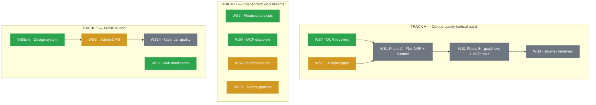

# NeoDemos v0.2 Workstream Handoffs

> **Purpose:** Each file in this directory is a self-contained agent-ready handoff for one workstream of the v0.2 Beat-MAAT plan. An agent (human or LLM) should be able to pick up a single handoff cold, do the work, and ship it without reading the master plan.
>
> **Master plan:** [`../architecture/V0_2_BEAT_MAAT_PLAN.md`](../architecture/V0_2_BEAT_MAAT_PLAN.md)
> **Roadmap:** [`../VERSIONING.md`](../VERSIONING.md)
> **Way of working:** [`../WAY_OF_WORKING.md`](../WAY_OF_WORKING.md)

---

## Handoff conventions

Every handoff file follows the same shape:

1. **TL;DR** — one paragraph an owner can read in 10 seconds
2. **Status** — `not started` / `in progress` / `blocked` / `review` / `done`
3. **Owner** — who's running it (default `unassigned`)
4. **Dependencies** — other handoffs that must finish first, or memory files to read
5. **Cold-start prompt** — copy-paste this directly into a fresh agent invocation
6. **Files to read first** — before touching code
7. **Build tasks** — concrete file paths and what to add/change
8. **Acceptance criteria** — checklist; all must be true to mark `done`
9. **Eval gate** — measurable thresholds (faithfulness, F1, latency, etc.)
10. **Risks specific to this workstream**

When a workstream finishes:
- Update its `Status` block at the top
- Tick the acceptance checkboxes
- Add a `## Outcome` section at the bottom with what shipped + diffs from the original plan
- Update [`../../CHANGELOG.md`](../../CHANGELOG.md) `[Unreleased]` block

---

## Workstream index

> **Last updated:** 2026-04-14

<!-- STATE-AUTO-START -->
| # | File | Title | Priority | Status | Depends on |
|---|---|---|---|---|---|
| WS1 | [`WS1_GRAPHRAG.md`](WS1_GRAPHRAG.md) | GraphRAG retrieval (Flair NER + Gemini enrichment + VN provenance) | 1 | **blocked** — waiting on WS11 | WS7, WS11 |
| WS8 | [`done/WS8_FRONTEND_REDESIGN.md`](done/WS8_FRONTEND_REDESIGN.md) | Frontend redesign: design system, landing, calendar | 1 | **done** — shipped 2026-04-12 | — |
| WS9 | [`done/WS9_WEB_INTELLIGENCE.md`](done/WS9_WEB_INTELLIGENCE.md) | Web intelligence: MCP-as-backend, Sonnet tool_use, SSE | 1 | **done** — shipped 2026-04-13 | — |
| WS11 | [`WS11_CORPUS_COMPLETENESS.md`](WS11_CORPUS_COMPLETENESS.md) | Corpus completeness 2018-2026 (ORI gap + metadata) | 1 | **in progress** — claimed via /ws-claim — resuming phase 6 (where we left off) | — |
| WS12 | [`WS12_VIRTUAL_NOTULEN_BACKFILL.md`](WS12_VIRTUAL_NOTULEN_BACKFILL.md) | Virtual notulen backfill & production hardening | 1 | **paused** — Deferred to v0.3/v0.4: Erik Verweij (only user so far) conf… | — |
| WS13 | [`WS13_MULTI_GEMEENTE_PIPELINE.md`](WS13_MULTI_GEMEENTE_PIPELINE.md) | Multi-gemeente pipeline: tenant-aware ingestion | 1 | **blocked** — waiting on WS5a | WS5a |
| WS14 | [`WS14_CALENDAR_QUALITY.md`](WS14_CALENDAR_QUALITY.md) | Calendar quality & bijlage reconciliation | 1 | **blocked** — waiting on WS8f | WS8f |
| WS15 | [`WS15_MOTIE_STEMMEN.md`](WS15_MOTIE_STEMMEN.md) | Per-party voting data (motie_stemmen + zoek_stemgedrag) | 1.5 | **available** — Initial seed: not_started | — |
| WS2 | [`done/WS2_FINANCIAL.md`](done/WS2_FINANCIAL.md) | Trustworthy financial analysis | 2 | **done** — shipped 2026-04-12 | — |
| WS2b | [`WS2b_IV3_TAAKVELD.md`](WS2b_IV3_TAAKVELD.md) | IV3 taakveld FK backfill | 2 | **available** | WS2 |
| WS8f | [`WS8f_ADMIN_CMS.md`](WS8f_ADMIN_CMS.md) | Admin panel + CMS + GrapeJS editor | 2 | **in progress** — Phase 7 — rejection follow-up: page creation + asset upload… | WS8 |
| WS16 | [`WS16_MCP_MONITORING.md`](WS16_MCP_MONITORING.md) | MCP monitoring & observability | 2 | **in progress** — Initial seed: Phase 1 shipped 2026-04-14 | WS4 |
| WS7 | [`done/WS7_OCR_RECOVERY.md`](done/WS7_OCR_RECOVERY.md) | OCR recovery for moties/amendementen | 2.5 | **done** — shipped 2026-04-14 | — |
| WS3 | [`WS3_JOURNEY.md`](WS3_JOURNEY.md) | Document journey timelines | 3 | **blocked** — waiting on WS1 | WS1 |
| WS4 | [`done/WS4_MCP_DISCIPLINE.md`](done/WS4_MCP_DISCIPLINE.md) | Best-in-class MCP surface | 4 | **done** — shipped 2026-04-13 | — |
| WS17 | [`WS17_FEEDBACK_LOOP.md`](WS17_FEEDBACK_LOOP.md) | Production feedback loop (detect → digest → close-the-loop) | 4 | **available** — Initial seed: not_started, v0.2.1 scope | WS4 |
| WS5a | [`WS5a_NIGHTLY_PIPELINE.md`](WS5a_NIGHTLY_PIPELINE.md) | 100% reliable nightly ingest | 5 | **in progress** — claimed via /ws-claim | — |
| WS5b | [`WS5b_MULTI_PORTAL.md`](WS5b_MULTI_PORTAL.md) | Multi-portal connectors (search-only) | 6 | **blocked** — waiting on WS5a | WS5a |
| WS10 | [`WS10_TABLE_RICH_EXTRACTION.md`](WS10_TABLE_RICH_EXTRACTION.md) | Table-rich document extraction (Docling layout) | 6 | **paused** — Infrastructure done; targeted 20-doc run only | — |
| WS6 | [`WS6_SUMMARIZATION.md`](WS6_SUMMARIZATION.md) | Source-spans-only summarization | 8 | **in progress** — Phase 3 DB write running; mode='structured' needs WS1 | — |
<!-- STATE-AUTO-END -->

**Webcast timestamp linking** (priority 7) is split across WS5a (schema + backfill) and WS5b (HLS player UI).

**WS8a-e shipped 2026-04-12. WS8f shipped 2026-04-13** — admin CMS with form editor + GrapeJS visual editor (v2: 27 component types with traits and structural locking on GrapeJS 0.22.15, site-CSS-aware editor canvas, template auto-loader), router split (main.py 1,508→250 lines), CSS modularized (4,037-line monolith → 12 files with @layer), subscription scaffolding. Pending Dennis QA.

**WS9 shipped 2026-04-13.** 18 tools via Sonnet + tool_use, SSE stream, IP rate limiting (3/month anon), teaser+expand UX, Gemini fallback. Live at `/api/search/stream`. Phase 4 manual eval (20 MCP-replay queries) pending.

**WS4 reliability follow-ups opened 2026-04-14** after two same-day MCP outages (routing double-mount bug + `ALTER TABLE users` holding an exclusive lock that stalled every `validate_api_token` call). Two items now queued in [WS4 §Post-ship reliability follow-ups](done/WS4_MCP_DISCIPLINE.md#post-ship-reliability-follow-ups-opened-2026-04-14): (1) 3 s `statement_timeout` on the auth path so blocked queries fail fast, (2) promote MCP from Kamal accessory to service role so every MCP deploy is blue-green zero-downtime (config already staged in `config/deploy.yml`). Rules distilled into [`feedback_mcp_uptime.md`](../../.claude/projects/-Users-dennistak-Documents-Final-Frontier-NeoDemos/memory/feedback_mcp_uptime.md).

**WS11 is the remaining Track A blocker.** WS7 ✅ done. WS12 deferred to v0.3/v0.4 (VN phases 1+4 live; 2018-2024 backfill is a nice-to-have, not a WS1 prerequisite). WS1 cannot start until WS11 finishes — enriching incomplete corpus wastes Gemini spend ($90-130) and requires re-run.

**WS1 Phase 1 execution is ready to fire the moment WS11 finishes.** All code is shipped and hardened (Phase 0 + Phase A bis + Phase 1 prep, commits `ce64706` → `cf43441` → `d6e1d58` → `44c87d5`). See [`WS1_GRAPHRAG.md` § Phase 1 Execution Runbook](WS1_GRAPHRAG.md#phase-1-execution-runbook-agent-pickup-point) for the 10-step command sequence a fresh agent can run cold. Script pre-flight checks auto-fail on incomplete upstream state so execution can't misfire.

**WS1 VN provenance addendum (2026-04-14):** Dennis surfaced the dilemma that VN data quality is uncertain but committee coverage requires VN inclusion. Resolution: standard provenance-aware KG pattern (Facebook KG / NELL). Every `kg_relationships` row gets `metadata.source` + `source_quality`; effective confidence = `base * source_quality`; query-time killswitch via existing `INCLUDE_VIRTUAL_NOTULEN` env var, now extended to graph_walk. Detailed in [`WS1_GRAPHRAG.md` § Phase A bis](WS1_GRAPHRAG.md#phase-a-bis--vn-provenance-layer-added-2026-04-14). No new workstream — folded into WS1 because it's a write-time + query-time hook on existing scripts.

**WS1 Gemini run cost + scope (2026-04-14):** verified against live corpus (1.74M chunks). At real Gemini Flash-Lite prices ($0.10/1M in, $0.40/1M out, Tier 3 paid), the targeted scopes are **`--scope p1`: ~$85 / 600K chunks / ~40 min**, **`--scope p1_p2` (default): ~$125 / 885K chunks / ~60 min**, **`--scope all`: ~$245 / 1.74M chunks / ~2h**. Truncation dropped (was cutting motie signatories at document bottom); replaced with smart chunk-selection filter. Hardened with exponential backoff on 429/5xx, JSON retry-once, pre-flight checks (BAG hierarchy ≥100, active-writer detection, staging.meetings quality_score coverage). Detailed in [`WS1_GRAPHRAG.md` § Phase A](WS1_GRAPHRAG.md#phase-a--kg-enrichment-foundations-35-days).

**WS10 is paused.** Infrastructure is fully built (classifier, converters, backfill script, MPS GPU, parallel writes, dedup). Full backfill of 655 unique PDFs was assessed as poor ROI: ~44% pass rate on large docs but the large docs dominate runtime (~70 min each), making a full run multi-day. Decision: do a targeted 20-doc run on the highest-ROI candidates (confirmed dry-run passes >500K chars), then defer full backfill to post-v0.2 when compute budget is available. WS10 is no longer a WS1 blocker.

**Middelburg** is the v0.2.1 press-moment city — Dennis has a contact there. Portal: Notubiz via ORI. **Verified 2026-04-13:** **28,434 MediaObject docs** in ORI (raw index count 45,835 includes deleted Lucene segments), 1,049 financial doc hits, PDFs publicly downloadable from `api.notubiz.nl` (no auth needed). Financial extraction is **v0.2.1 scope** — no native Notubiz adapter required. **Apeldoorn and Maastricht are Parlaeus, not iBabs** — ORI-only in v0.2.1, native adapter in v0.3.0. Full municipalities registry: `data/municipalities_index.json` (309 municipalities, Phase 1/2/3 roadmap, backend detected from ORI `original_url`). Waalwijk remains a quiet MAAT counter-demo.

---

## Parallelism map

```
v0.2.0 — three parallel tracks

  TRACK A (ACTIVE NOW): Corpus quality — WS11
  ┌─────────────────────────────────────────────────────────────────┐
  │  WS11 running NOW. Must finish before WS1 can start.             │
  │  WS10 paused (targeted 20-doc run only, not a blocker).          │
  │                                                                  │
  │  ┌──────────────┐  ┌──────────────┐                             │
  │  │ WS7 ✅ DONE  │  │ WS11  (run)  │                             │
  │  │ OCR recovery │  │ Corpus gaps  │                             │
  │  │ 2026-04-14   │  │ ORI backfill │                             │
  │  └──────┬───────┘  └──────┬───────┘                             │
  │         │                 │                                      │
  │         └────────────────┘                                       │
  │                  │                                               │
  │                  ▼                                               │
  │  ┌──────────────────────────────────────────────────────────┐    │
  │  │  WS1 Phase A — Flair NER + Gemini enrichment             │    │
  │  │  ~500K KG edges, motie↔notulen linking                   │    │
  │  │  (blocked until WS11 completes)                          │    │
  │  └──────────┬───────────────────────────────────────────────┘    │
  │             │                                                    │
  │             ▼                                                    │
  │  ┌──────────────────────────────────────────────────────────┐    │
  │  │  WS1 Phase B — graph_retrieval.py + MCP tools            │    │
  │  │  traceer_motie, vergelijk_partijen                        │    │
  │  └──────────┬───────────────────────────────────────────────┘    │
  │             │                                                    │
  │             ▼                                                    │
  │  ┌─────────────┐                                                │
  │  │     WS3     │                                                │
  │  │  Journey    │                                                │
  │  │  (no UI)    │                                                │
  │  └─────────────┘                                                │
  │                                                                  │
  │  ► eval gate A ◄                                                │
  └─────────────────────────────────────────────────────────────────┘

  TRACK B: Independent workstreams (can start anytime)
  ┌─────────────────────────────────────────────────────────────────┐
  │  No dependencies on Track A. Start when capacity allows.         │
  │                                                                  │
  │  ┌──────────────┐  ┌────────────┐  ┌────────┐  ┌────────────┐  │
  │  │ WS2 ✅ DONE  │  │ WS4 ✅DONE │  │  WS6   │  │    WS5a    │  │
  │  │  Financial   │  │  MCP disc. │  │ Summary│  │  Nightly   │  │
  │  │ (2026-04-12) │  │(2026-04-14)│  │        │  │  pipeline  │  │
  │  └──────────────┘  └────────────┘  └────────┘  └────────────┘  │
  └─────────────────────────────────────────────────────────────────┘

  TRACK C: Public launch (WS8 + WS9 + WS14) — independent of Tracks A & B
  ┌─────────────────────────────────────────────────────────────────┐
  │                                                                  │
  │  ┌──────────────────────────────────────────────────────────┐    │
  │  │  WS8a-e ✅ DONE (2026-04-12)                              │    │
  │  │  Design tokens, landing page, calendar, subpages, polish  │    │
  │  └──────────────────────────────────────────────────────────┘    │
  │                                                                  │
  │  ┌──────────────────────┐   ┌──────────────────────────────┐    │
  │  │  WS9 ✅ DONE         │   │  WS8f ⚠️ QA REJECTED         │    │
  │  │  Sonnet+tool_use     │   │  Admin CMS — direction TBD   │    │
  │  │  deployed 2026-04-13 │   │  (GrapeJS UX insufficient)   │    │
  │  └──────────────────────┘   └──────────────┬───────────────┘    │
  │                                            │                    │
  │                                            ▼                    │
  │                              ┌──────────────────────────────┐    │
  │                              │  WS14 — Calendar quality     │    │
  │                              │  bijlage reconciliation +    │    │
  │                              │  dedup                       │    │
  │                              └──────────────┬───────────────┘    │
  │                                             │                    │
  │                                             ▼                    │
  │  ► eval gate C ◄  → public launch + press outreach              │
  └─────────────────────────────────────────────────────────────────┘

v0.2.1 — search-only beyond Rotterdam
  ┌──────────────┐  ┌──────────────┐  ┌──────────────┐
  │     WS5b     │  │  WS3 UI      │  │ Webcast HLS  │
  │ ORI fallback │  │  /journey    │  │ player + cite│
  └──────────────┘  └──────────────┘  └──────────────┘
```

> Node colours below are auto-generated by `scripts/coord/update_readme_index.py` — do not edit between the markers.

<!-- PARALLELISM-AUTO-START -->

<!-- PARALLELISM-AUTO-END -->

**Critical path (Track A):** WS7 ✅ done → WS11 (running, NOW) → WS1 Phase A (enrichment) → WS1 Phase B (graph svc + MCP) → WS3. *(WS12 deferred; not a WS1 blocker.)*
**Critical path (Track C):** WS9 ✅ done, WS8f ⚠️ QA rejected (CMS direction TBD). **Track C gated on WS14** (calendar quality / bijlage reconciliation) — press outreach waits until /calendar shows complete, non-duplicated document data for 2023-2026.
**Active blockers:** WS1 held until WS11 finishes — enriching garbled/incomplete text wastes Gemini spend ($90-130) and requires re-run.
**WS10 removed from critical path** — infrastructure done, targeted run only, not a WS1 dependency.
**No blockers for:** WS5a (WS4 ✅ done 2026-04-14). **WS6 is in progress** (Phase 3 backfill running; ~95% `verified=True` on sample).

---

## Eval gate for tagging v0.2.0

### Track A — Corpus quality (must complete before WS1 enrichment)

| Metric | Source | Target | Status |
|---|---|---|---|
| OCR recovery | WS7 BM25 re-test | BM25 hit rate ≥ 95% (from 77.5%) | ✅ done 2026-04-14 — BM25 83.7% (up from 77.6%); 4,192 docs recovered; embed backfill in WS11 <!-- EVAL:WS7 --> |
| Table-rich extraction | WS10 targeted run | ~20 high-ROI docs re-processed, quality gate passed | ⏳ paused — targeted run pending |
| Corpus completeness | WS11 ORI audit | schriftelijke_vragen gap < 5% (from 96%) | ✅ 0 gap (3,851 in DB); P1 types ingest running <!-- EVAL:WS11 --> |
| Virtual notulen | WS12 promotion | 2025 promoted, 2018-2024 backfill complete | ⏳ in progress <!-- EVAL:WS12 --> |
| Metadata backfill | WS11a | All 30 named types labelled; NULL = unidentifiable only | ✅ 62,627 classified; ~26,754 NULL (genuinely unidentifiable) <!-- EVAL:WS11 --> |

### Track A — Data quality (must pass before tag)

| Metric | Source | Target | Status |
|---|---|---|---|
| Completeness | [rag_evaluator/](../../rag_evaluator/) | ≥ 3.5 (from 2.75) | ❌ blocked on WS1 <!-- EVAL:WS1 --> |
| Faithfulness | [rag_evaluator/](../../rag_evaluator/) | ≥ 4.5 (no regression) | ❌ blocked on WS1 <!-- EVAL:WS1 --> |
| Numeric accuracy | WS2 financial benchmark | **100%** on 30 questions | ✅ shipped <!-- EVAL:WS2 --> |
| IV3 taakveld coverage | WS2b backfill | ≥ 80% of financial_lines | ❌ not started <!-- EVAL:WS2b --> |
| MCP bug backlog cleared | WS4 blockers B1–B8 | All 8 bugs fixed before eval run | ✅ shipped 2026-04-14 <!-- EVAL:WS4 --> |
| Nightly reliability | WS5a smoke test logs | 14 consecutive clean days | ❌ not started <!-- EVAL:WS5a --> |
| Source-spans strip test | WS6 verifier | Pass on 50 random docs | ⏳ Phase 3 running — sample shows ~4.4% `verified=False` (reranker 429'd, content still saved) <!-- EVAL:WS6 --> |
| Tool-description uniqueness | WS4 startup check | No pair > 0.85 cosine | ✅ shipped 2026-04-14 <!-- EVAL:WS4 --> |
| KG Layer 2 size | WS1 quality audit | ≥ 500K relationship edges | ❌ blocked on WS1 <!-- EVAL:WS1 --> |

### Track C — Public launch (must pass before press outreach)

| Metric | Source | Target | Status |
|---|---|---|---|
| Demo answer quality | Manual review by Dennis | Impressive enough to be first thing a journalist sees | ✅ done 2026-04-14 <!-- EVAL:WS9 --> |
| Lighthouse Performance | `lighthouse https://neodemos.nl` | ≥ 90 | ✅ WS8 shipped <!-- EVAL:WS8 --> |
| Lighthouse Accessibility | `lighthouse https://neodemos.nl` | ≥ 95 (WCAG AA) | ✅ WS8 shipped <!-- EVAL:WS8 --> |
| WS9 MCP quality parity | Side-by-side comparison (web vs MCP) | ≥ 90% answer quality vs direct MCP | ✅ done 2026-04-14 <!-- EVAL:WS9 --> |
| Mobile search above fold | Playwright screenshot at 375px | Search bar + CTA visible without scroll | ✅ WS8 shipped <!-- EVAL:WS8 --> |
| Demo answer cached | `GET /` response time | < 200ms (pre-rendered, no API call) | ✅ done 2026-04-14 <!-- EVAL:WS9 --> |
| Landing headline rotation | Config check | `LANDING_HEADLINE` env var wired, weekly swap documented | ✅ WS8 shipped <!-- EVAL:WS8 --> |
| Calendar bijlage visibility | WS14 A1 re-run | % of 2023-2026 meetings (with ≥1 agenda_item, excl. procedural-only) showing ≥1 bijlage ≥ **95%** | ❌ blocked on WS14 <!-- EVAL:WS14 --> |
| Calendar duplicate meetings | WS14 A7 re-run | 0 logical-duplicate meetings on /calendar | ❌ blocked on WS14 <!-- EVAL:WS14 --> |
| Calendar duplicate docs | WS14 walk of 2023-2026 meetings | 0 documents duplicated within a single agenda item | ❌ blocked on WS14 (C1 hotfix removes most) <!-- EVAL:WS14 --> |
| Calendar annotatie/bijlage split | Manual UI smoke on 20 meetings | Bijlagen rendered in prominent section; annotaties de-emphasized | ❌ blocked on WS14 Phase D <!-- EVAL:WS14 --> |

---

## How to invoke an agent on a handoff

For a fresh LLM agent (Claude Code, Cursor, etc.):

1. Open the handoff file (e.g. `done/WS2_FINANCIAL.md`)
2. Copy the **Cold-start prompt** block verbatim
3. Paste into the agent's first message
4. Let the agent read its `Files to read first`, then start the `Build tasks`
5. The agent should not need to read other handoffs unless its `Dependencies` say so

For a human owner: just read top-to-bottom and check off `Acceptance criteria` as you go.

---

## House rules (apply to every workstream)

These are project-wide and override anything in an individual handoff:

1. **Never write to Qdrant/Postgres while a background embedding/migration is running.** Use `pg_advisory_lock(42)` or coordinate via the `pipeline_runs` table (built in WS5a). Memory: [project_embedding_process.md](../../../.claude/projects/-Users-dennistak-Documents-Final-Frontier-NeoDemos/memory/project_embedding_process.md)
2. **Cloud-first dev.** All work hits the Hetzner Postgres + Qdrant via SSH tunnel. Start with `./scripts/dev_tunnel.sh --bg`. Never spin up local DB containers.
3. **Conventional naming.** New MCP tools use Dutch `verb_noun` (`zoek_*`, `haal_*_op`, `vat_*_samen`, `traceer_*`, `vergelijk_*`). New services live in `services/`. New pipeline steps live in `pipeline/` or `scripts/`. New tables get an Alembic migration.
4. **Test on staging before promoting.** KG/financial/journey writes go through staging schemas first. Use [scripts/promote_*](../../scripts/) helpers.
5. **Cite back to the master plan.** Each PR description should reference the workstream (e.g. "WS2 — financial_lines table") so reviewers can find context.
6. **Update the handoff file as you go.** Status → in progress → review → done. Add an `## Outcome` section at the bottom when shipped.
7. **No scope creep.** If a handoff suggests "while we're here, we should also…" — write it down in the handoff's `## Future work` section instead of doing it. The whole point of the multi-workstream split is to ship in parallel without entanglement.
